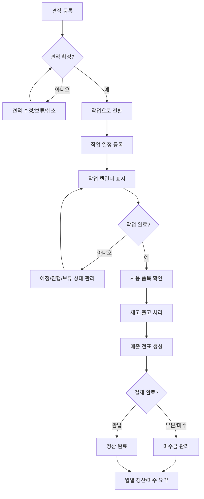
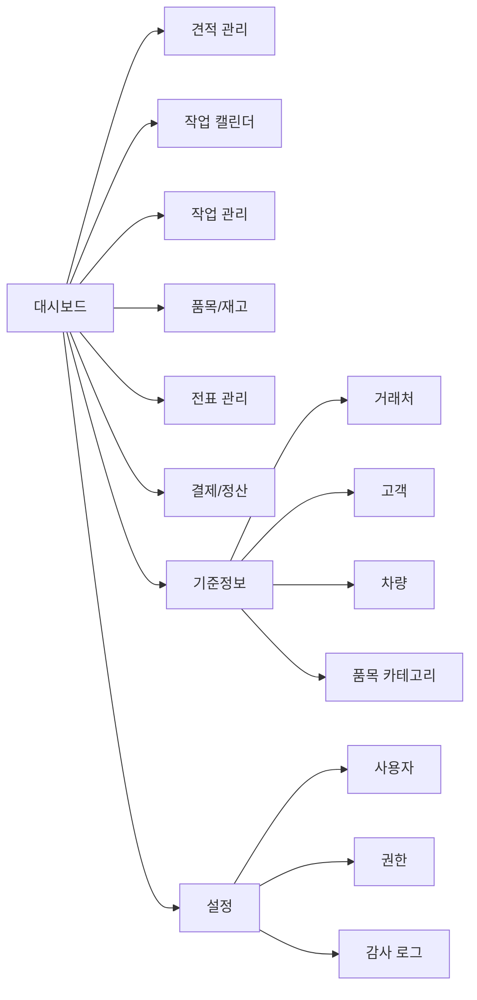
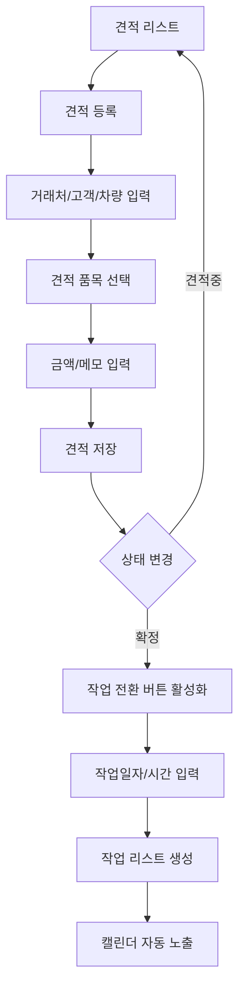
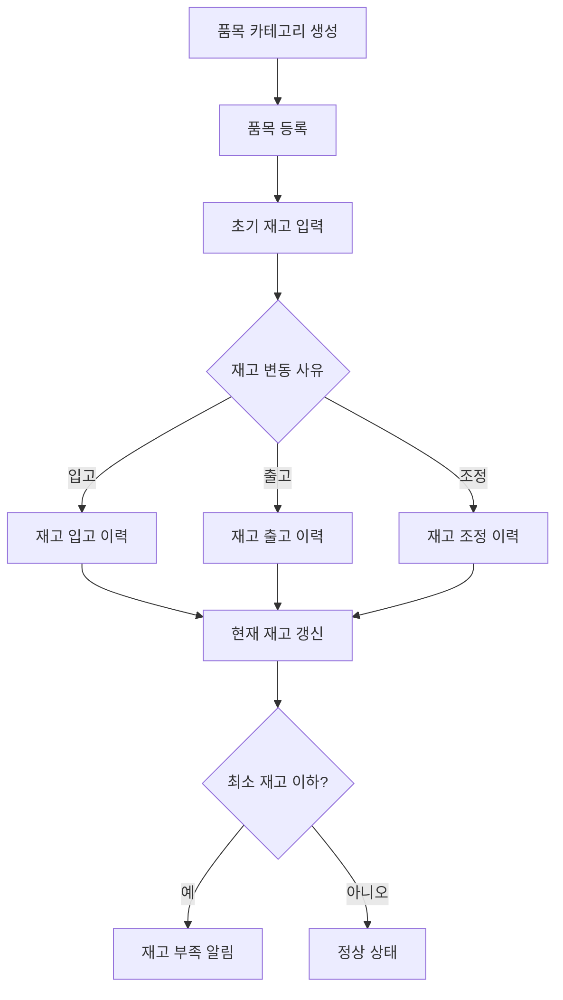
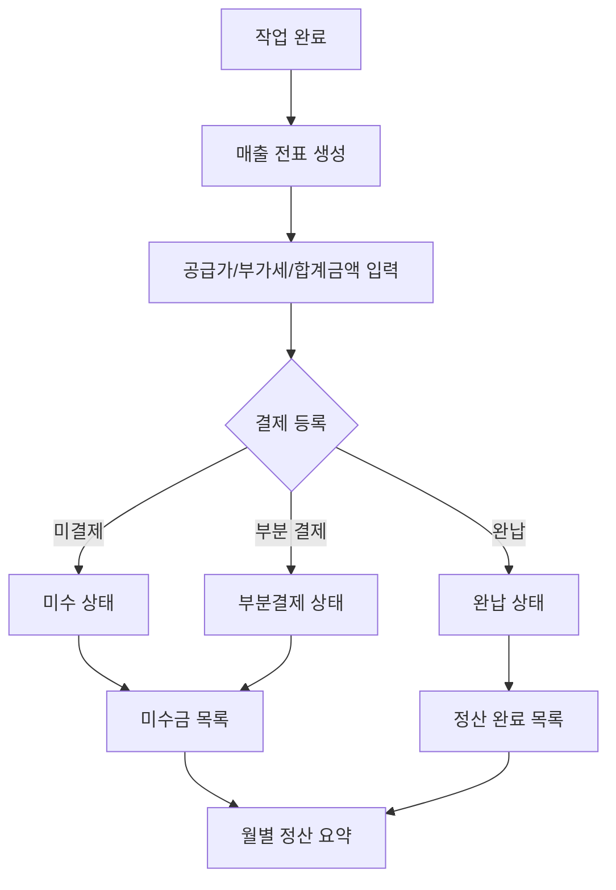
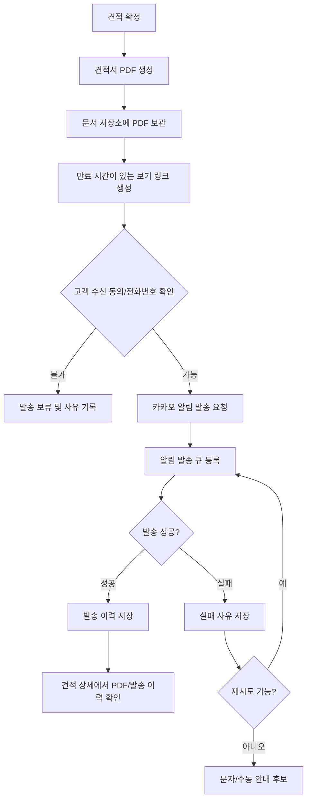
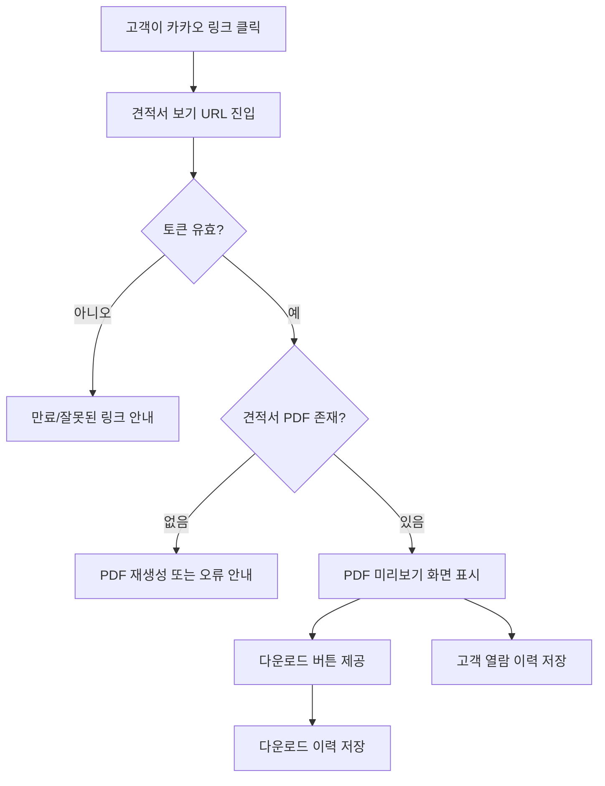
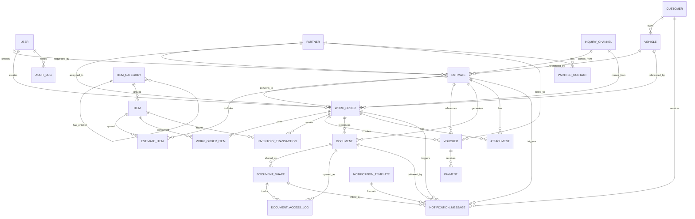

# MVP Design

경남차유리 ERP의 MVP는 견적, 작업, 품목/재고, 전표, 결제 정산이 하나의 업무 흐름으로 이어지는 기초형 ERP를 목표로 한다.

## MVP Goal

```text
구글시트 없이 견적 접수부터 작업 일정, 재고 차감, 전표 생성, 결제/미수 확인까지 기본 사무업무가 돌아가게 만든다.
```

## Core Business Flow



## Menu Flow



## Estimate To Work Flow



## Inventory Flow



## Voucher And Payment Flow



## Estimate PDF And Kakao Flow

MVP에서는 PDF 발송을 직접 구현하지 않더라도, 견적서 PDF 생성과 카카오 알림 발송을 고려한 구조로 설계한다. 카카오 메시지는 PDF 파일을 직접 첨부하는 방식보다, 견적서 PDF를 볼 수 있는 안전한 링크를 버튼으로 전달하는 방식을 기본으로 한다.



## Customer PDF View Flow

카카오 메시지의 링크를 누르면 고객은 별도 로그인 없이 견적서를 확인할 수 있어야 한다. 대신 URL에는 추측하기 어려운 토큰과 만료 시간을 두고, 접근 이력을 남긴다.



### PDF Delivery Design Notes

- 견적서 PDF는 견적 확정 시점의 스냅샷으로 저장한다.
- 견적이 수정되면 기존 PDF를 덮어쓰지 않고 새 버전으로 생성한다.
- 고객에게는 PDF 파일 자체보다 보기/다운로드 링크를 전달한다.
- 링크를 누르면 견적서 전용 PDF 뷰어 페이지로 이동한다.
- 링크에는 만료 시간과 접근 토큰을 둔다.
- 고객 전화번호, 수신 동의, 발송 결과, 실패 사유를 반드시 기록한다.
- 카카오 API 실패가 견적 저장이나 작업 예약을 막지 않도록 발송 큐를 분리한다.

## Data Relationship



## MVP Screens

- 로그인
- 대시보드
- 견적 리스트
- 견적 등록/상세
- 작업 리스트
- 작업 등록/상세
- 작업 사진 첨부
- 작업 캘린더
- 거래처 관리
- 정비소 관리
- 보험사/보험 담당자 관리
- 문의 경로 관리
- 고객 관리
- 차량 관리
- 품목 카테고리 관리
- 품목 관리
- 재고 입출고
- 전표 관리
- 결제/정산
- 견적서 PDF/발송 이력
- 사용자/권한 설정
- 감사 로그

## Development Order

1. DB 스키마 확정
2. 기준정보 API: 거래처, 고객, 차량, 품목 카테고리, 품목
3. 견적 CRUD
4. 작업 CRUD와 견적 전환
5. 캘린더 조회
6. 재고 입출고와 작업 완료 시 재고 차감
7. 전표 생성과 결제 상태 관리
8. 대시보드 요약
9. 로그인, 권한, 감사 로그
10. 견적서 PDF 생성과 카카오 알림 발송

## Future Extension Points

- 여러 창고 재고
- 바코드/QR 입출고
- 엑셀 업로드/다운로드
- 카카오 알림톡
- 견적서 PDF 보기 링크
- 세금계산서 연동
- 외부 회계 프로그램 연동
- 품목별 원가/마진 분석
- 모바일 작업 확인 화면

## Final Review Checklist

개발 착수 전에 아래 항목을 기준으로 범위와 설계를 확인한다.

- 견적서에 들어갈 필수 정보: 거래처, 고객명, 고객 전화번호, 차량정보, 작업구분, 품목, 수량, 단가, 공급가, 부가세, 합계금액, 메모
- 보험/청구 필수 정보: 보험사, 보험 담당자, 접수번호, 보험청구금액, 보험입금금액, 고객결제금액
- 작업 필수 정보: 방문/출장 구분, 출장자, 수리구분, 수리부위, 작업 사진
- 고객 알림 정보: 고객 전화번호, 카카오 수신 동의, 수신 동의/거부 일시
- PDF 링크 보안: 토큰, 만료 시간, 폐기 처리, 열람/다운로드 이력
- 번호 규칙: 견적번호, 작업번호, 전표번호, 품목코드 자동 채번
- 상태 규칙: 견적, 작업, 전표, 결제, 알림 발송 상태
- 삭제 정책: 업무 데이터는 실제 삭제보다 취소/미사용/폐기 상태로 관리
- 재고 정책: 입고, 출고, 조정은 모두 이력으로 남기고 현재 재고는 이력과 함께 갱신
- 금액 정책: 공급가, 부가세, 합계금액, 부분결제, 미수금 계산 기준
- 권한 정책: 관리자, 직원, 조회 전용 권한의 메뉴/수정 범위
- 감사 로그: 견적, 작업, 재고, 전표, 결제, 사용자 권한 변경 기록
- 백업 정책: DB 백업, PDF 파일 백업, 장애 복구 기준

## Decisions Before Implementation

아래는 개발 중 결정해도 되지만, 초기에 정하면 구현이 더 빠르다.

- 견적서 PDF 디자인 양식
- 카카오 알림톡 발송 대행사 선택
- 카카오 알림톡 템플릿 문구
- PDF 링크 만료 기간
- 부가세 기본 적용 여부
- 작업 완료 시 전표를 자동 생성할지, 확인 후 생성할지
- 작업 완료 시 재고를 자동 차감할지, 사용 품목 확인 후 차감할지
- 기존 구글시트 데이터 이전 여부
