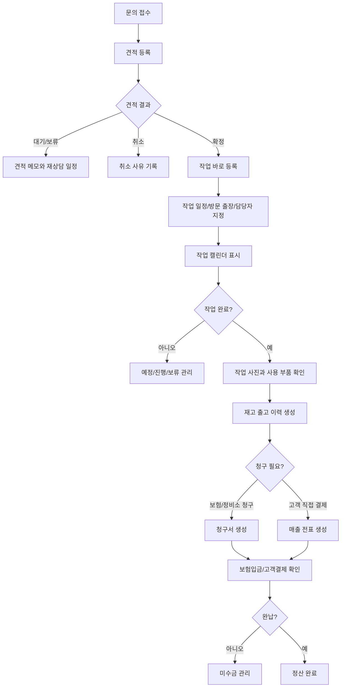
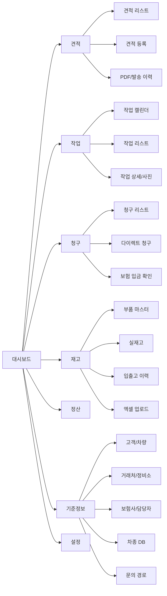
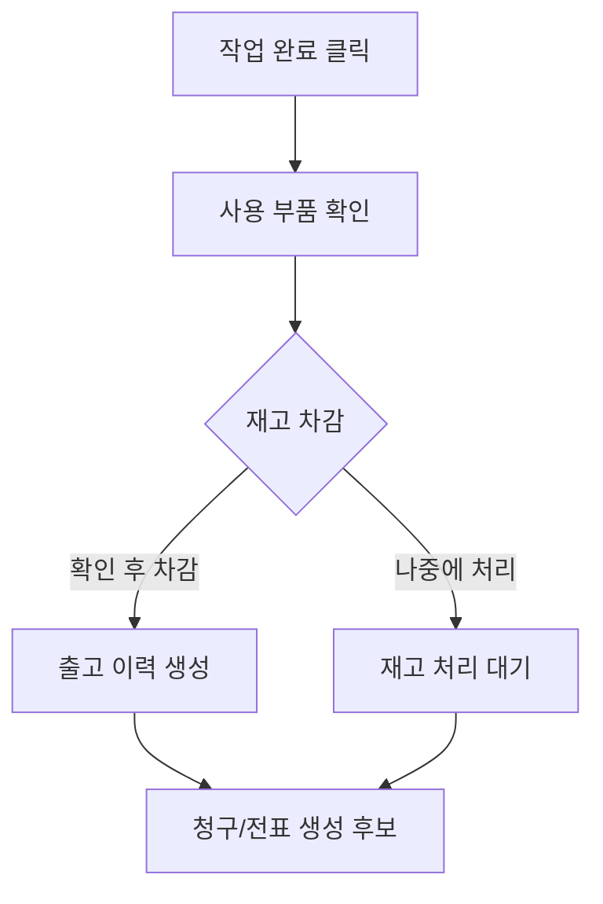

# MVP V2 Design

경남차유리 ERP MVP V2는 **하나의 자동차유리 매장**에서 견적, 작업, 청구, 재고, 정산을 끊기지 않게 처리하는 실무형 ERP를 목표로 한다.

기존 글로벌 ERP 분석은 참고하되, 여러 지점/대리점/외주 조직이 동시에 쓰는 구조는 MVP의 기본 전제로 두지 않는다. 현재 목표는 한 가게의 업무를 빠르고 정확하게 돌리는 것이며, 다매장/멀티업체 운영은 고도화 단계에서 확장한다.

## Product Principle

```text
한 매장에서 매일 반복하는 견적 접수, 작업 예약, 부품 확인, 보험 청구, 입금 확인을 구글시트 없이 처리한다.
```

MVP V2의 기준:

- 기본 사용자는 한 매장의 관리자와 직원이다.
- 지점/대리점 선택은 필수 업무 흐름에서 제외한다.
- 거래처, 정비소, 보험사, 보험 담당자는 기준정보로 관리한다.
- 견적 저장, 작업 등록, 청구 생성은 사용자의 의도를 명확히 나눈다.
- 업무 데이터는 실제 삭제보다 취소, 미사용, 폐기 상태로 관리한다.
- 향후 여러 업체가 쓸 수 있도록 데이터 모델에는 확장 여지를 남기되, 화면은 단일 매장 기준으로 단순하게 만든다.

## MVP V2 Scope

### Included

- 로그인 기본 구조와 role 기반 권한 고려
- 오늘 업무 대시보드
- 견적 등록, 수정, 검색, 상태 관리
- 견적에서 작업 바로 등록
- 작업 리스트와 작업 캘린더
- 방문/출장 구분, 출장자, 작업 사진
- 일반 청구와 다이렉트 청구
- 보험사, 보험 담당자, 정비소, 거래처 관리
- 고객과 차량 관리
- 차종 DB와 부품 마스터
- 품목/재고 관리와 입출고 이력
- 작업 완료 시 사용 부품 확인 후 재고 차감
- 매출 전표, 입금, 미수금 관리
- 견적서 PDF 생성과 링크 공유 기반 알림 이력
- 엑셀 업로드/다운로드의 기초 구조
- 주요 변경 감사 로그

### Excluded From MVP

- 다중 회사가 같은 시스템을 독립적으로 쓰는 멀티테넌트 구조
- 여러 지점의 권한/정산/재고를 완전히 분리하는 조직 관리
- 회계 프로그램 자동 연동
- 보험사 API 직접 연동
- 바코드/QR 기반 입출고
- 모바일 기사 전용 앱
- 전자세금계산서 자동 발행
- 최고 관리자 기반 계정 생성, 직원/알바 계정 발급, 세부 권한 관리

## Core Workflow



## Information Architecture



## Dashboard

첫 화면은 목록을 보여주는 곳이 아니라, 오늘 처리해야 할 일을 알려주는 화면이다.

핵심 카드:

- 오늘 작업
- 견적 대기
- 청구 대기
- 미수금
- 부족 재고
- 이번 달 매출

핵심 목록:

- 오늘 작업 일정
- 입금 확인이 필요한 청구
- 최소 재고 이하 부품
- 최근 견적 문의

## Search And Selection UX

기준정보 목록이 많아지는 항목은 라디오 버튼이나 긴 셀렉트 박스로 나열하지 않는다. 기본 패턴은 `typeahead`, 즉 검색형 자동완성 선택이다.

### Selection Rules

- 항목이 10개 이하인 고정값: 라디오 또는 세그먼트 컨트롤
- 항목이 30개 이하인 단순값: 셀렉트
- 항목이 계속 늘어나는 기준정보: typeahead combobox
- 여러 개를 선택할 수 있는 옵션: multi-select typeahead
- 같은 항목을 여러 번 넣을 수 있는 업무: typeahead로 선택한 뒤 라인 아이템으로 추가
- 정확한 값을 몰라도 저장해야 하는 항목: 자유 입력 + 나중에 기준정보 연결

### Typeahead Targets

- 고객
- 차량번호
- 차대번호
- 거래처
- 정비소
- 보험사
- 보험 담당자
- 문의경로
- 차종 DB: 브랜드, 시리즈, 모델
- 부품 마스터: 부품번호, 호환품번, 품명
- 재고 품목
- 작업 담당자/출장자
- 옵션: ADAS, 레인센서, 열선, HUD, 차음유리, 솔라, 쉐이드밴드 등
- 수리부위: 전면유리, 후면유리, 도어유리, 쿼터글라스 등

### Typeahead Behavior

- 최소 2글자 입력 후 검색한다.
- 결과는 기본 20개만 보여주고, 더보기 또는 상세 검색을 제공한다.
- 최근 사용 항목과 자주 쓰는 항목을 먼저 보여준다.
- 검색 결과에는 이름만 보여주지 말고 구분에 필요한 보조 정보를 함께 표시한다.
- 선택 후에도 사용자가 표시명을 확인할 수 있게 칩 또는 요약 카드 형태로 보여준다.
- 검색 결과가 없으면 `새로 등록` 또는 `임시 입력으로 저장`을 제공한다.
- 키보드 방향키, Enter, Esc 조작을 지원한다.
- 선택값을 바꾸면 연결된 부품/청구/재고 정보가 바뀔 수 있으므로 주요 변경은 확인한다.
- 다중 선택 항목은 선택된 값을 칩으로 보여주고, 각 칩은 바로 제거할 수 있게 한다.
- 옵션/수리부위처럼 같은 값이 중복될 이유가 없는 항목은 중복 선택을 막는다.
- 청구 라인/사용 부품처럼 같은 품목이 여러 번 들어갈 수 있는 항목은 중복 선택을 막지 않고, 수량/단가/메모가 있는 별도 라인으로 추가한다.

### API And Database Notes

- typeahead API는 `q`, `limit`, `cursor` 또는 `page`를 받는다.
- 고객 전화번호, 차량번호, 차대번호, 부품번호, 호환품번, 보험사명, 정비소명은 인덱스를 둔다.
- 전화번호와 차량번호는 하이픈/공백 제거값으로도 검색 가능하게 한다.
- 부품 검색은 부품번호, 호환품번, 한글 품명, 영문 품명을 함께 검색한다.
- 차종 검색은 브랜드 -> 시리즈 -> 모델 순서의 단계형 typeahead를 기본으로 한다.

## Automation And Calculation

자동 계산이 가능한 값은 사용자가 직접 계산하지 않게 한다. 단, 자동 계산된 값은 항상 수동 수정이 가능해야 하고, 수동 수정 시 사유 또는 메모를 남길 수 있게 한다.

### Amount Calculation

자동 계산 대상:

- 공급가 = 라인별 공급가 합계
- 부가세 = 공급가 x 기본 세율
- 청구합계 = 공급가 + 부가세
- 라인 합계 = 수량 x 단가 - 할인 + 공임
- 보험사 지급책임액 = 청구합계 - 자기부담금
- 미수금 = 청구합계 또는 매출합계 - 입금합계
- 고객결제 잔액 = 고객결제금액 - 고객입금합계
- 보험입금 잔액 = 보험청구금액 - 보험입금합계
- 평균매입가 = 재고 입고 금액 합계 / 입고 수량 합계
- 현재 재고 = 입고 - 출고 + 조정
- 부족 재고 여부 = 현재 재고 <= 최소 재고

계산값 UX:

- 자동 계산값 옆에는 계산 기준을 짧게 보여준다.
- 사용자가 직접 수정한 값은 `수동 수정` 표시를 남긴다.
- 금액 수정 이력은 견적, 작업, 청구, 전표에 남긴다.
- 원 단위 절사/반올림 기준은 설정에서 관리한다.

### Workflow Assist

자동 제안 대상:

- 고객 연락처 입력 시 기존 고객/차량 후보 표시
- 차량번호 입력 시 과거 견적/작업 이력 표시
- 차종 선택 시 연결 가능한 부품 후보 표시
- 부품 선택 시 센터가, 보험청구단가, M/H, 공임금액 자동 채움
- 수리부위가 전면유리이고 옵션에 ADAS/카메라가 있으면 ADAS 보정 필요 후보 표시
- 보험 청구유형 선택 시 보험사, 보험 담당자, 접수번호 입력 영역 표시
- 작업 완료 시 사용 부품, 재고 차감, 청구/전표 생성 후보 표시
- 입금 등록 시 관련 청구/전표 미수금에 자동 배분 후보 표시

자동화 제한:

- 상태 변경, 재고 차감, 청구 확정, 전표 확정은 자동 제안 후 사용자 확인을 거친다.
- 사용자가 모르는 정보 때문에 저장이 막히지 않도록 `미정`, `나중에 입력`, `임시 입력`을 지원한다.
- 자동 계산과 자동 제안은 감사 로그에 남길 필요는 없지만, 확정된 업무 변경은 감사 로그에 남긴다.

## Estimate Design

견적은 업무의 시작점이다. 글로벌 ERP처럼 한 화면에 모든 정보를 넣을 수는 있지만, 경남차유리 ERP에서는 입력 흐름을 단계로 나눈다.

### Requiredness Rule

문의 접수와 견적 저장은 최대한 가볍게 만든다. 차량 세부정보와 부품 세부정보는 정확한 견적과 작업 확정에 필요하지만, 첫 저장을 막는 필수값으로 두지 않는다.

견적 첫 저장 필수값:

- 문의일 또는 견적일
- 견적 담당자
- 문의 내용 또는 간단 메모

견적 단계 권장값:

- 고객 연락처
- 고객명
- 차량번호
- 수리구분
- 수리부위
- 방문/출장 희망

작업 바로 등록 시 필수값:

- 작업일
- 작업시간 또는 시간 미정
- 방문/출장 구분
- 작업 담당자 또는 출장자

정확한 부품 견적/청구 전 권장값:

- 브랜드
- 시리즈
- 모델명
- 년식
- 차대번호
- 부품번호
- 옵션
- 썬팅
- 보험사
- 보험 담당자
- 접수번호

### Estimate Fields

- 문의일: 필수, 기본값 오늘
- 견적 담당자: 필수, 실제 견적낸 사람을 이름 드롭다운으로 선택
- 문의 내용 또는 메모: 필수
- 입력자: 현재 로그인 사용자로 자동 기록
- 고객 연락처: 선택
- 문의경로: 선택
- 고객명: 선택
- 차량번호: 선택
- 차대번호: 선택
- 브랜드: 선택
- 시리즈: 선택
- 모델명: 선택
- 년식: 선택
- 수리구분: 선택
- 수리부위: 선택
- 부품번호: 선택
- 옵션: 선택
- 썬팅: 선택
- 입고처 또는 매입처: 선택
- 매입금액: 선택
- 결제수단: 선택
- 자기부담금: 선택
- 보험청구금액: 선택
- 고객결제금액: 선택
- 작업 희망일: 선택
- 방문/출장: 선택
- 출장자: 선택
- 상담사/입력자: 현재 사용자로 자동 기록, 견적 담당자와 별도 관리
- 메모: 선택

### Repair Classification

글로벌 ERP의 `수리구분`은 유리 작업 종류라기보다 보험/정산 성격에 가까웠다.

- 자차
- 대물(무과실)
- 대물(과실)
- 배상책임
- 일반

경남차유리 ERP에서는 의미가 섞이지 않도록 `수리구분`, `수리부위`, `결제/청구유형`을 분리한다.

수리구분:

- 교체
- 복원
- 탈부착
- 점검
- 썬팅
- ADAS 보정
- 기타

수리부위:

- 전면유리
- 후면유리
- 운전석 도어유리
- 조수석 도어유리
- 운전석 뒤 도어유리
- 조수석 뒤 도어유리
- 쿼터글라스
- 벤트글라스
- 썬루프/파노라마
- 몰딩
- 카울
- 기타

결제/청구유형:

- 일반
- 자차
- 대물(무과실)
- 대물(과실)
- 배상책임
- 정비소 청구

옵션 정보는 별도 다중 선택으로 관리한다.

- ADAS/카메라
- 레인센서
- 열선
- HUD
- 차음/어쿠스틱
- 솔라/자외선 차단
- 쉐이드밴드
- OEM 요청
- 애프터마켓 가능

썬팅은 부품 옵션이 아니라 작업 또는 부가 서비스로도 쓰일 수 있으므로, 자유 입력과 선택값을 함께 지원한다.

### Estimate Status

- `DRAFT`: 작성중
- `QUOTED`: 견적 완료
- `WAITING`: 고객 대기
- `CONFIRMED`: 확정
- `CONVERTED`: 작업 전환
- `CANCELED`: 취소

### Estimate Actions

- 견적 저장
- 견적 확정
- 작업 바로 등록
- PDF 생성
- 링크 공유
- 복사
- 취소

`작업 바로 등록`은 저장과 다른 의도다. 이 버튼은 작업일, 작업시간, 방문/출장, 담당자를 확인한 뒤 작업을 생성한다.

## Work Order Design

작업은 캘린더 중심으로 운영한다. 리스트는 검색과 일괄 확인을 위한 보조 화면이다.

### Work Order Fields

- 작업번호
- 연결 견적
- 작업일
- 작업 시작 시간
- 작업 종료 시간
- 방문/출장 구분
- 출장자 또는 작업 담당자
- 고객/차량
- 수리구분
- 수리부위
- 사용 부품
- 작업 메모
- 작업 사진
- 보험사
- 보험 담당자
- 접수번호
- 보험청구금액
- 보험입금금액
- 고객결제금액

### Work Order Status

- `SCHEDULED`: 예정
- `IN_PROGRESS`: 진행
- `COMPLETED`: 완료
- `HOLD`: 보류
- `CANCELED`: 취소

### Completion Rule

작업 완료 시 바로 재고를 차감하지 않고, 사용 부품 확인 단계를 거친다.



## Claim Design

청구는 작업 이후의 보험/정비소/고객 정산을 관리한다. MVP V2에서는 일반 청구와 다이렉트 청구를 구분한다.

### Claim Types

- `GENERAL`: 작업에서 생성된 일반 청구
- `DIRECT`: 작업 없이 바로 작성하는 다이렉트 청구

### Claim Fields

- 청구번호
- 청구유형
- 청구상태
- 연결 작업
- 고객/차량
- 정비공장
- 정비 담당자
- 보험사
- 보험 담당자
- 접수번호
- 청구일자
- 입금일자
- 기준공임
- 공급가
- 부가세
- 청구합계
- 보험사 지급책임액
- 자기부담금
- 보험입금금액
- 고객결제금액
- 메모

### Claim Line Items

청구 라인은 반복 가능한 구조로 관리한다.

- 유리
- 실란트
- 카울
- 트림
- 몰딩
- 자사부품
- 공임
- 기타

각 라인의 기본 필드:

- 구분
- 부품번호
- 품명 또는 작업내역
- 수량
- 부품단가
- 할인율
- M/H
- 공임금액
- 공급가
- 부가세
- 합계
- 비고

### Claim Status

- `DRAFT`: 작성중
- `REQUESTED`: 청구 완료
- `PARTIALLY_PAID`: 일부 입금
- `PAID`: 입금 완료
- `HOLD`: 보류
- `CANCELED`: 취소

## Parts And Inventory Design

MVP V2에서는 `부품 마스터`와 `실재고`를 분리한다.

### Part Master

부품 마스터는 기준 데이터다. 실제 수량보다 부품의 속성과 청구 기준을 관리한다.

- 부품번호
- 국내/수입
- 부품구분
- 부품구분2
- 호환품번 1~5
- 영문 품명
- 한글 품명
- 센터가
- 보험청구단가
- M/H
- 공임금액
- 기본 공급처
- 비고
- 사용 여부

### Inventory Item

실재고는 매장에 실제로 있는 품목과 수량이다.

- 연결 부품 마스터
- 품번
- 품명
- 재고위치
- 현재 재고
- 최소 재고
- 평균매입가
- 최근매입가
- 매입처
- 비고

### Inventory Transaction

재고 수량은 직접 덮어쓰기보다 이력으로 관리한다.

- 입고
- 출고
- 조정
- 이동
- 작업 사용
- 폐기

## Vehicle Catalog Design

차종 DB는 고객 차량과 부품 검색을 빠르게 하기 위한 기준 데이터다.

- 국내/수입
- 브랜드
- 시리즈
- 모델
- 년식 범위
- CARNO 또는 내부 차종 코드
- 연결 부품 수
- 사용 여부

고객 차량은 실제 차량 데이터이며, 차종 DB와 연결될 수 있다.

- 고객
- 차량번호
- 차대번호
- 브랜드
- 시리즈
- 모델명
- 년식
- 메모

## Partner And Insurance Design

단일 매장 기준에서는 거래처 유형을 단순하게 관리한다.

### Partner Types

- 일반 거래처
- 매입처
- 외주업체
- 정비소
- 보험사

### Insurance Contact

보험 담당자는 보험사에 소속된 담당자로 관리한다.

- 보험사
- 담당자명
- 직급
- 전화번호
- 휴대폰
- 이메일
- 팩스
- 현 담당 여부
- 이전 담당 전환일
- 비고

청구 데이터에는 당시 선택된 보험 담당자를 저장해 이력을 보존한다. 이후 담당자가 바뀌어도 과거 청구의 담당자 정보가 흔들리지 않아야 한다.

## Customer And Partner 360 View

고객, 거래처, 정비소, 보험사 같은 주요 대상은 목록만 제공하지 않고 상세 화면에서 관련 정보를 한눈에 볼 수 있게 한다.

### Customer Detail

고객 상세에서 볼 정보:

- 기본 정보: 이름, 연락처, 메모, 수신 동의
- 보유 차량
- 견적 이력
- 작업 이력
- 청구/결제 이력
- 미수금
- 첨부 파일
- 상담/메모 타임라인
- 최근 활동

### Partner Detail

거래처/정비소/보험사 상세에서 볼 정보:

- 기본 정보: 업체명, 사업자번호, 대표자, 담당자, 연락처, 이메일, 주소
- 담당자 목록
- 연결된 견적
- 연결된 작업
- 청구/전표/입금 이력
- 미수금 또는 미지급금
- 세금계산서 파일
- 계약서, 사업자등록증, 통장사본 등 첨부 파일
- 상담/메모 타임라인

### Detail Page Principle

- 사용자가 고객사 또는 고객을 클릭하면 관련 업무와 파일을 한 화면에서 확인할 수 있어야 한다.
- 고객/차량 목록은 기본적으로 테이블 리스트로 제공하고, 목록에서 고객을 클릭하면 상세 360도 정보를 모달로 확인한다.
- 고객/차량 목록 검색은 고객명, 연락처, 차량번호, 차대번호, 메모, 최근 작업 이력을 모두 포함하는 전체 범위 typeahead 검색으로 제공한다.
- 견적/작업/청구/전표/문서를 각각 따로 찾아다니지 않게 한다.
- 상세 화면은 `요약`, `이력`, `문서`, `정산`, `메모` 탭으로 나눈다.

## File Attachment Policy

MVP에서는 범용 문서함을 먼저 만들기보다, 각 업무 상세 화면에 필요한 파일을 첨부하는 수준으로 시작한다.

MVP 파일 첨부 대상:

- 견적: 파손 사진, 견적 관련 이미지, 견적서 PDF
- 작업: 작업 전/후 사진, 시공 사진
- 청구: 청구서 PDF, 보험 접수/승인 자료
- 거래처/정비소/보험사: 사업자등록증, 통장사본, 계약서 등 필요한 기준정보 파일

범용 문서함, 폴더 기반 문서 관리, 외부 다운로드 파일 수집함, 세금계산서 파일 모음은 MVP가 아니라 고도화 단계로 둔다.

## Future Document Vault

고도화 단계에서는 꼭 고객사 정보가 아니더라도, 사용자가 폴더를 만들고 다양한 문서를 ERP 안에 모아둘 수 있는 문서함을 제공한다.

### Document Types

- 견적서 PDF
- 청구서 PDF
- 세금계산서
- 보험 접수/승인 자료
- 정비소 자료
- 사업자등록증
- 통장사본
- 계약서
- 작업 사진
- 고객 전달 이미지
- 기타 외부 다운로드 파일
- 사용자가 직접 만든 폴더의 일반 파일

### Document Links

문서는 하나 이상의 업무 대상에 연결될 수 있다.

- 고객
- 차량
- 거래처/정비소/보험사
- 견적
- 작업
- 청구
- 전표
- 결제
- 사용자 지정 폴더

### External Document Inbox

처음 업로드한 파일은 `외부 자료 수집함`에 들어간다. 사용자는 파일을 확인한 뒤 고객, 거래처, 차량, 견적, 작업, 청구, 전표 중 필요한 대상에 연결한다.

수집함 필드:

- 파일명
- 문서 종류
- 업로드일
- 자료 출처
- 관련 고객/거래처
- 관련 차량번호
- 관련 청구/전표
- 처리 상태: 미분류, 확인필요, 연결완료, 보류
- 메모

이메일, 카카오톡, 국세청, 회계 프로그램, 클라우드 드라이브에서 자동 수집하는 기능도 고도화 단계에서 검토한다.

### Tax Invoice Files

세금계산서 파일은 전표와 연결해서 보관한다.

- 발행/수취 구분
- 거래처
- 작성일자
- 공급가
- 부가세
- 합계
- 승인번호 또는 문서번호
- 연결 전표
- 파일
- 입금/지급 상태

세금계산서 파일이 있어도 회계 계산의 기준은 전표 데이터다. 파일은 증빙과 확인용으로 보관한다.

## Voucher And Payment Design

전표와 결제는 실제 돈의 흐름을 추적한다.

### Voucher Types

- 매출
- 매입
- 입금
- 출금

### Payment States

- 미결제
- 부분결제
- 완납
- 취소

보험 업무에서는 세 금액을 분리해서 본다.

- 보험청구금액
- 보험입금금액
- 고객결제금액

미수금은 `청구합계 또는 매출합계 - 입금합계`로 계산한다. 단, 자기부담금과 보험 지급책임액이 있는 경우에는 보험 입금과 고객 결제를 분리해서 보여준다.

## PDF And Notification Design

견적서 PDF는 확정 시점의 스냅샷이다. 견적이 수정되면 기존 PDF를 덮어쓰지 않고 새 버전을 만든다.

공유 방식:

- PDF 파일 생성
- 만료 시간이 있는 링크 생성
- 고객 전화번호와 수신 동의 확인
- 카카오 알림톡 또는 문자 발송 큐 등록
- 발송 성공/실패 기록
- 고객 열람/다운로드 이력 기록

MVP에서는 실제 카카오 발송 API 연동이 늦어져도, 발송 이력과 링크 구조는 먼저 설계한다.

## Database Design Impact

현재 Prisma 스키마에서 유지할 핵심 모델:

- `User`
- `Partner`
- `PartnerContact`
- `InquiryChannel`
- `Customer`
- `Vehicle`
- `Estimate`
- `WorkOrder`
- `ItemCategory`
- `Item`
- `InventoryTransaction`
- `Voucher`
- `Payment`
- `Attachment`
- `Document`
- `NotificationMessage`
- `AuditLog`

MVP V2에서 보강할 모델:

- `ShopProfile`: 단일 매장 정보, 사업자번호, 대표자, 연락처, 기본 주소
- `VehicleCatalog`: 브랜드, 시리즈, 모델, 년식, CARNO
- `PartMaster`: 부품번호, 호환품번, 보험청구단가, M/H, 공임금액
- `PartCompatibility`: 차종 DB와 부품 마스터 연결
- `InventoryLocation`: 재고 위치
- `Claim`: 일반 청구/다이렉트 청구
- `ClaimLineItem`: 청구 라인
- `PaymentAllocation`: 보험입금/고객결제 등 입금 배분
- `InsuranceContactSnapshot`: 청구 당시 보험 담당자 스냅샷
- `ExcelImportJob`: 엑셀 업로드 검증과 결과

MVP에서는 `ShopProfile`을 하나만 사용한다. 향후 여러 업체가 쓰게 되면 `Organization`, `Branch`, `Membership` 구조로 확장한다.

## Screen List

### MVP Screens

- 로그인
- 대시보드
- 견적 리스트
- 견적 등록/상세
- 작업 캘린더
- 작업 리스트
- 작업 상세/사진
- 청구 리스트
- 다이렉트 청구 등록
- 보험 입금 확인
- 부품 마스터 리스트
- 부품 마스터 등록/상세
- 실재고 리스트
- 재고 입고/출고/조정
- 차종 DB 리스트
- 고객/차량 관리
- 고객 상세 360도 화면
- 거래처 관리
- 거래처/정비소/보험사 상세 360도 화면
- 정비소 관리
- 보험사/보험 담당자 관리
- 문의 경로 관리
- 전표 관리
- 결제/미수금 관리
- PDF/발송 이력
- 사용자/권한
- 감사 로그

### Preferred Build Order

1. DB 스키마 V2 확정
2. 공통 typeahead 검색 API와 선택 컴포넌트
3. 단일 매장 기본 설정과 사용자/권한
4. 기준정보: 고객, 차량, 거래처, 정비소, 보험사, 보험 담당자, 문의 경로
5. 차종 DB와 부품 마스터
6. 재고 위치와 실재고
7. 견적 CRUD
8. 견적에서 작업 바로 등록
9. 작업 캘린더와 작업 완료
10. 사용 부품 확인과 재고 출고
11. 청구와 다이렉트 청구
12. 전표, 입금, 미수금
13. 고객/거래처 상세 360도 화면
14. 대시보드 요약
15. PDF 생성과 링크 공유 이력
16. 엑셀 업로드/다운로드
17. 감사 로그와 운영 보완

## Future Expansion

여러 업체 또는 여러 지점에서 쓰는 구조는 고도화 단계로 둔다.

확장 시 추가할 개념:

- `Organization`: 업체 또는 법인
- `Branch`: 지점/매장/창고
- `Membership`: 사용자와 업체 권한 연결
- 지점별 재고
- 지점별 작업 캘린더
- 지점별 매출/미수 통계
- 업체별 데이터 격리
- 업체별 PDF 양식과 알림톡 템플릿
- 본사/지점 권한 분리
- 범용 문서함과 사용자 지정 폴더
- 외부 자료 수집함
- 세금계산서 파일 모음과 전표 연결
- 이메일, 카카오톡, 클라우드 드라이브, 국세청, 회계 프로그램 문서 자동 수집
- OCR 기반 세금계산서/청구서 자동 인식

MVP V2에서는 위 구조를 바로 만들지 않는다. 대신 주요 모델에 향후 `organizationId`, `branchId`를 붙일 수 있도록 이름과 책임을 명확히 유지한다.

## Open Decisions

개발 전에 결정하면 좋은 항목:

- 견적서 PDF 양식
- 부가세 자동 계산 방식
- 자기부담금 계산 방식
- 보험청구금액과 고객결제금액의 기본 입력 순서
- typeahead에서 검색 결과가 없을 때 바로 기준정보 등록을 허용할지
- typeahead 다중 선택에서 같은 항목 중복 추가를 허용할 업무 범위
- 자동 계산값을 수동 수정할 때 사유 입력을 필수로 할지
- 작업 완료 시 전표 자동 생성 여부
- 작업 완료 시 재고 자동 차감 여부
- 다이렉트 청구서 양식
- 엑셀 업로드 중복 처리 기준
- 고객 전화번호 마스킹 정책
- 취소/폐기 데이터 보존 기간

## MVP V2 Success Criteria

- 매장 직원이 견적을 등록하고 작업으로 바로 전환할 수 있다.
- 작업자는 오늘 작업을 캘린더에서 확인할 수 있다.
- 작업 완료 후 사용 부품과 사진을 남길 수 있다.
- 재고는 현재 수량뿐 아니라 입출고 이력으로 추적된다.
- 보험 청구와 고객 결제를 분리해서 관리할 수 있다.
- 미수금 목록에서 받아야 할 금액을 바로 확인할 수 있다.
- 부품번호, 차량, 보험사, 정비소 검색이 반복 입력을 줄인다.
- 금액, 세금, 미수금, 재고 수량은 자동 계산되어 수기 계산을 줄인다.
- 여러 부품, 여러 수리부위, 여러 옵션을 다중 선택하거나 라인으로 추가할 수 있다.
- 고객이나 거래처 상세에서 견적, 작업, 청구, 전표, 문서, 메모를 한눈에 확인할 수 있다.
- 업무 상세 화면에서 필요한 파일과 사진을 첨부할 수 있다.

## Inventory KPI

재고 화면은 목록만 보여주지 않고, 상단에 부품/재고 KPI를 제공한다.

- 총 보유수량: 현재 보유 중인 전체 수량과 품목 수
- 부족 재고: 현재 재고가 최소 재고보다 낮은 품목 수와 대표 품목
- 확인 필요: 단가, 호환차종, 위치, 열선/ADAS 여부 등 확인이 필요한 품목
- 재고 평가액: 현재 재고 수량 x 센터가 기준 금액
- 청구 기준가: 현재 재고 수량 x 보험청구단가 기준 금액
- 예상 차액: 청구 기준가 - 재고 평가액

이 KPI는 발주 우선순위, 작업 전 부품 확보 여부, 보험청구 단가 확인을 빠르게 판단하기 위한 요약 정보다.

## Account And Permission V2 Plan

이번 개발에서는 로그인 화면과 로그인 편의 기능까지만 반영한다. 계정 생성과 권한 관리는 V2 고도화 범위로 둔다.

V2 계정 운영 원칙:

- 일반 사용자의 회원가입은 제공하지 않는다.
- 최고 관리자만 사용자 계정을 생성하고 권한을 변경할 수 있다.
- 직원 계정과 알바 계정을 생성할 수 있어야 한다.
- 알바 계정은 근무 기간, 배정 작업, 민감정보 마스킹 범위를 별도로 설정할 수 있게 한다.
- 아이디 찾기와 비밀번호 찾기는 우선 제공하지 않고, 최고 관리자가 임시 비밀번호를 재발급하는 방식으로 둔다.
- 퇴사자와 단기 알바는 삭제보다 비활성화 상태로 관리한다.

초기 role 설계:

- `SUPER_ADMIN`: 계정 생성, 권한 변경, 전체 메뉴 접근
- `ADMIN`: 운영 관리, 매출/장부/청구/재고 관리
- `STAFF`: 견적, 작업, 고객/차량 조회, 사진 첨부
- `PART_TIMER`: 배정된 작업 확인, 사진 첨부, 제한된 고객/차량 정보 조회
- `VIEWER`: 조회 전용

개발 고려사항:

- `User`에는 우선 `role` 필드를 두고, 실제 권한은 `role -> permissions` 매핑으로 해석한다.
- 프론트 메뉴 숨김뿐 아니라 API에서도 권한을 검사한다.
- 향후 세부 권한이 필요해지면 `Role`, `Permission`, `RolePermission`, 사용자별 예외 권한 구조로 확장한다.

## Login Page Design

로그인 화면은 참고 레퍼런스처럼 중앙 정렬의 단순한 구조로 만든다.

- 회사 로고는 제공받은 `경남차유리` SVG를 사용하고, 화면명은 `경남차유리 업무관리`로 표현한다.
- 입력 항목은 아이디와 비밀번호만 둔다.
- 입력값이 없을 때는 로그인 버튼을 비활성화한다.
- 백엔드 인증 전까지 프로토타입에서는 더미 로그인으로 ERP 화면 진입만 확인한다.
- 회원가입, 아이디 찾기, 비밀번호 찾기는 MVP 화면에서 제외한다.
- ID 저장과 자동로그인은 로그인 편의 기능으로 제공하되, 비밀번호는 저장하지 않는다.
- 실제 계정 생성과 권한 관리는 V2 고도화의 최고 관리자 기능으로 둔다.
- 프로토타입 테스트 계정은 `test / test123@`로 둔다.

## UI Writing And Font

화면 글자는 현장 직원이 바로 이해할 수 있는 짧은 한국어를 우선한다.

- 기본 폰트는 `Pretendard` 계열을 사용한다.
- 화면에는 불필요한 영어를 쓰지 않는다.
- `Dashboard` 대신 `홈`, `Attachments` 대신 `자료`처럼 쉬운 단어를 사용한다.
- `KPI`, `Typeahead` 같은 개발/기획 용어는 화면에 노출하지 않는다.
- 수량 단위는 `EA` 대신 `개`로 표시한다.
- 실제 삭제 없이 취소/미사용 상태로 운영 이력을 보존한다.
