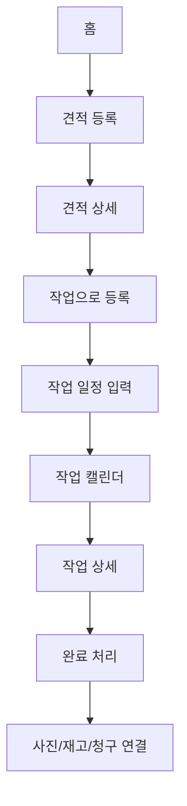
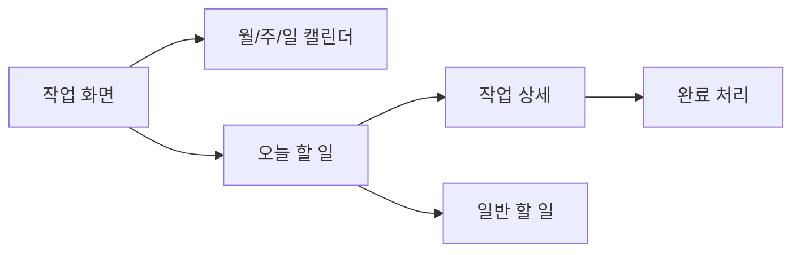

# 포트폴리오 정리본 - 경남차유리 업무관리 ERP

이 문서는 노션 포트폴리오에 복사하기 쉽게 정리한 프로젝트 케이스 스터디 초안이다.

공개 전 주의:

- 실제 계정, 비밀번호, 연락처, 주소, 차량번호, 차대번호 등 민감 정보는 공개하지 않는다.
- 클라이언트명 공개 가능 여부가 확정되기 전에는 `자동차유리 업체 업무관리 ERP`처럼 익명화해서 사용한다.
- 화면 캡처에는 실제 고객 데이터가 아닌 더미 데이터를 사용한다.

## 프로젝트 한 줄 소개

자동차유리 매장의 견적, 작업 일정, 청구, 재고, 고객 자료를 한 화면 흐름 안에서 관리할 수 있도록 설계한 내부 ERP 프로토타입.

## 프로젝트 배경

기존 업무는 견적과 작업 스케줄을 구글시트에 수기로 입력하고 관리하는 방식이었다. 이 방식은 빠르게 시작할 수 있다는 장점은 있지만, 시간이 지나면 다음 문제가 생긴다.

- 견적과 작업 일정이 분리되어 재입력이 발생한다.
- 작업일, 작업시간, 거래처, 차량정보를 한눈에 보기 어렵다.
- 일정이 변경되거나 작업이 완료된 뒤 이력을 추적하기 어렵다.
- 청구, 재고, 자료가 별도 관리되면 같은 정보를 반복해서 찾아야 한다.
- IT에 익숙하지 않은 사용자가 복잡한 ERP를 바로 쓰기는 어렵다.

따라서 이 프로젝트의 목표는 처음부터 대형 ERP를 만드는 것이 아니라, 실제 매장 직원이 매일 쓰기 쉬운 내부 업무관리 시스템을 먼저 만드는 것이다.

## 사용자와 사용 환경

주 사용자는 자동차유리 매장 내부 직원이다.

사용자 특성:

- 외부 고객용 서비스가 아니다.
- 동시 사용자는 소수다.
- 복잡한 설정 화면보다 빠른 입력과 조회가 중요하다.
- 견적, 작업, 청구, 재고를 모두 한 번에 완성하기보다 단계적으로 보완하는 흐름이 필요하다.
- 페이지 로딩과 입력 반응이 느리면 사용성이 크게 떨어진다.

## 핵심 문제 정의

이 프로젝트에서 해결해야 하는 핵심 문제는 다음과 같다.

1. 견적을 입력한 뒤 작업 일정으로 자연스럽게 넘길 수 있어야 한다.
2. 작업 일정은 월/주/일 캘린더에서 바로 확인되어야 한다.
3. 캘린더와 오늘 할 일 목록이 함께 있어야 실제 하루 업무를 놓치지 않는다.
4. 고객, 차량, 부품, 청구, 자료가 각각 흩어지지 않고 연결되어야 한다.
5. 화면은 심플해야 하지만, 자동차유리 업무에 필요한 실무 필드는 놓치면 안 된다.

## 레퍼런스 분석

### 기존 글로벌 ERP

기존 글로벌 ERP는 기능 범위가 넓다.

- 견적 관리
- 작업 관리
- 청구 관리
- 재고 관리
- 부품 마스터
- 차종 DB
- 거래처/정비소/보험사 관리
- 보험사 담당자 관리
- 엑셀 업로드
- 통계

장점:

- 자동차유리 업무에 필요한 실제 필드가 많다.
- 견적, 작업, 청구, 재고, 업체 관리 도메인이 잘 드러난다.
- 보험 청구와 부품/재고 구조를 참고하기 좋다.

아쉬운 점:

- 오래된 관리자형 UI에 가까워 초보 사용자가 이해하기 어렵다.
- 목록 테이블에 정보가 너무 많다.
- 필터와 검색 조건이 빽빽하다.
- 등록 화면이 긴 폼 중심이라 입력 순서가 부담스럽다.
- 캘린더보다 리스트 중심이라 오늘 해야 할 일이 약하게 보인다.

### 우리가 선택한 방향

기존 시스템의 업무 필드는 참고하되, 화면 구조는 그대로 따라가지 않았다.

선택한 방향:

- 홈에서는 오늘 할 일과 처리 필요 업무를 먼저 보여준다.
- 견적, 작업, 청구, 재고는 메뉴로 나누되 공통 검색/필터 패턴을 사용한다.
- 작업 화면은 캘린더와 오늘 할 일을 함께 보여준다.
- 상세 정보는 별도 페이지 이동보다 오른쪽 패널로 확인한다.
- 등록 화면은 한 번에 모든 필드를 보여주기보다 필수값 먼저 저장하고 보완하는 흐름으로 설계한다.

## 사용자 Flow

### 기본 업무 Flow

### 작업 화면 Flow

작업 화면은 단순한 달력이 아니라 매장 업무의 중심 화면으로 설계했다. 유리 교체 작업뿐 아니라 보험 접수번호 확인, 부품 발주 확인, 거래처 입금 확인 같은 일반 할 일도 같은 캘린더에서 관리할 수 있도록 했다.

## 정보 구조

현재 프로토타입의 주요 메뉴:

- 홈
- 견적
- 작업
- 청구
- 재고
- 고객
- 거래처
- 자료
- 설정

MVP 핵심:

- 로그인
- 홈 대시보드
- 견적 목록/등록
- 견적에서 작업 전환
- 작업 캘린더
- 오늘 할 일
- 작업 상세
- 고객/차량 상세
- 전체 검색

고도화 후보:

- 다이렉트 청구
- 부품 마스터
- 차종 DB
- 보험사 담당자 관리
- 엑셀 업로드/다운로드
- 통계
- 범용 문서함
- 멀티 매장/멀티 업체 지원

## UI/UX 설계 원칙

1. 목록은 가볍게 보여주고, 상세는 오른쪽 패널에서 충분히 보여준다.
2. 등록 버튼, 검색, 필터 위치는 모든 목록 화면에서 통일한다.
3. 필수 입력값을 최소화하고, 모르는 값은 나중에 보완할 수 있게 한다.
4. 상태 변경, 삭제, 청구 생성 같은 중요한 작업은 명확한 버튼과 확인 흐름을 둔다.
5. 삭제보다 취소, 보류, 미사용 같은 상태 관리 방식을 우선한다.
6. 고객명, 연락처, 차량번호, 차대번호 등 민감 정보는 운영 단계에서 마스킹과 권한 기준을 적용한다.
7. 기존 ERP의 필드는 참고하되, 화면은 내부 직원이 빠르게 이해할 수 있게 단순화한다.

## 공통 UI 컴포넌트

반복되는 UI를 공통 컴포넌트로 정리했다.

| 컴포넌트 | 역할 |
|---|---|
| `BrandIdentity` | 로고와 상호 표시 |
| `Panel` | 제목과 본문을 가진 기본 영역 |
| `RecordToolbar` | 검색, 필터, 건수, 등록 버튼을 묶는 목록 상단 영역 |
| `SearchInput` | 전체 검색과 자동완성 후보 |
| `FilterTabs` | 상태별 필터 |
| `DetailDrawer` | 오른쪽에서 열리는 상세 패널 |
| `ActionFooter` | 저장/닫기 같은 하단 버튼 묶음 |
| `FormSection` | 입력 폼 구역 나누기 |
| `DataTable` | 목록 표 |
| `StatusPill` | 상태 뱃지 |
| `KpiCard` | 홈/재고 숫자 요약 카드 |

## 현재 프로토타입에 반영된 화면

### 로그인

- 회원가입 없이 내부 직원 로그인만 제공한다.
- 테스트 계정은 프로토타입 확인용이며 운영 단계에서는 제거한다.
- 로고와 상호가 중복되지 않도록 단순하게 배치했다.

### 홈

- 오늘 할 일
- 견적 대기
- 청구 대기
- 미수금
- 부족 재고
- 처리 필요 업무
- 업무 바로가기
- 최근 견적
- 고객 상세 요약

업무 바로가기는 자주 쓰는 외부 사이트를 대시보드에서 바로 열 수 있게 만든 영역이다. 프로토타입에서는 제목과 링크를 입력하면 화면에서 임시로 추가되고, 실제 저장은 백엔드 연결 이후 사용자 설정 기능으로 확장한다.

### 견적

- 견적 목록
- 전체 검색
- 상태 필터
- 빠른 견적 입력
- 예상 청구합계 자동 계산 UI
- 견적 상세 패널
- 견적에서 작업 등록 패널로 이어지는 Flow

보강 필요:

- 실제 저장/API 연결
- 작업 등록 후 캘린더 반영 데이터 처리

### 작업

- 일/주/월/년 캘린더
- 오늘 할 일 목록
- 작업과 일반 할 일 구분
- 작업 등록/할 일 등록 버튼 분리
- 선택한 작업 처리 영역
- 작업 상세 패널
- 작업 완료 처리 패널
- 사진/재고/청구 연결 미리보기

보강 필요:

- 작업 등록 패널
- 완료 처리 후 실제 데이터 변경

### 청구

- 청구/입금 목록
- 검색/필터
- 다이렉트 청구 예시
- 자동 계산 영역
- 청구 상세 패널
- 입금 처리 미리보기

보강 필요:

- 보험사 담당자/접수번호 연결
- 실제 입금 처리 저장

### 재고

- 재고 KPI
- 부품/재고 목록
- 검색/필터
- 센터가와 보험청구단가 비교
- 부품 상세 패널
- 입출고 이력 미리보기

보강 필요:

- 작업 완료 시 재고 차감
- 실제 입출고 저장

### 고객/자료

- 고객/차량 목록
- 고객 상세 오른쪽 패널
- 업무 이력 요약
- 업무 자료 목록
- 자료 상세 패널
- 연결 업무 미리보기

보강 필요:

- 고객 상세에서 견적/작업/청구/자료를 더 자세히 연결
- 파일 첨부 Flow

## 기술 스택

현재 프로토타입 기준:

- React
- TypeScript
- Vite
- npm workspaces

향후 백엔드 후보:

- NestJS
- PostgreSQL
- Prisma

프로토타입 단계에서는 DB/API를 붙이지 않고, 더미 데이터로 화면 Flow를 먼저 검증한다.

## 배포 방향

초기 프로토타입:

- 정적 프론트엔드 배포
- Cloudflare Pages 또는 Vercel 후보

MVP 내부 사용:

- 프론트엔드 정적 배포
- Supabase 또는 저가 VPS 기반 DB/API 검토

API가 필요한 단계:

- Railway, Render, Fly.io, 국내 VPS 등 비용 중심으로 검토

## 검증 방식

현재까지 적용한 검증:

- TypeScript 타입 검사
- 프로토타입 스크립트 검사
- 빌드 전 빠른 점검 스크립트

빌드는 사용자가 요청할 때만 실행한다.

## 포트폴리오에서 강조할 포인트

이 프로젝트는 단순히 화면을 만든 작업이 아니라, 다음 과정을 보여줄 수 있다.

- 실제 요구사항 문서 분석
- 기존 ERP 레퍼런스 분석
- 사용자의 업무 Flow 재정의
- 복잡한 관리자형 ERP를 쉬운 내부 업무툴로 재설계
- 자동차유리 업무에 맞춘 도메인 이해
- 공통 UI 컴포넌트 설계
- 프로토타입 우선 개발 전략
- 배포 비용과 운영 방식 검토
- DB/API 이전에 UX 검증을 먼저 하는 접근

## 다음 작업 우선순위

1. 견적 상세 패널
2. 견적에서 작업으로 등록하는 패널
3. 작업 상세 패널
4. 작업 완료 처리 Flow
5. 사진/재고/청구 연결
6. 청구 상세 및 입금 처리
7. 재고 상세 및 입출고 이력
8. 자료 상세 및 첨부 Flow
9. 실제 DB 모델 설계
10. API 연결

## 노션 구성 추천

노션에 옮길 때는 다음 구조를 추천한다.

1. 프로젝트 개요
2. 문제 정의
3. 사용자와 업무 환경
4. 기존 시스템 분석
5. 사용자 Flow 설계
6. UI/UX 설계 원칙
7. 화면별 설계
8. 공통 컴포넌트
9. 기술 스택
10. 검증과 배포 계획
11. 회고 및 다음 단계
