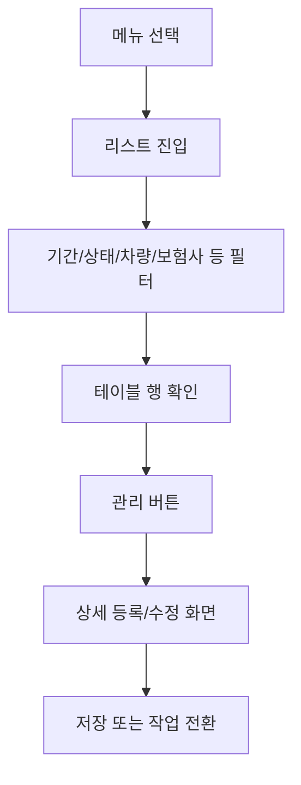
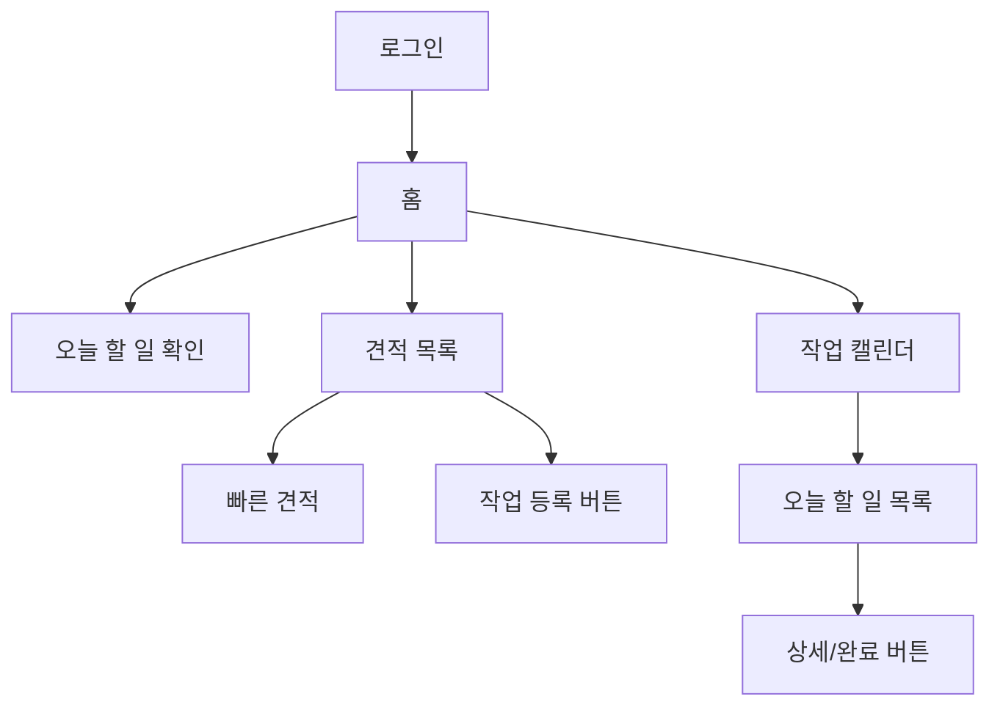
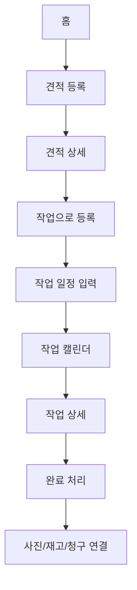

# UI/UX 및 사용자 Flow 비교 분석

이 문서는 경남차유리 업무관리 프로토타입을 기준으로, 클라이언트 요구사항 문서, 기존 글로벌 ERP 분석, 현재 프로토타입을 비교한 설계 판단 기록이다.

데이터 취급 원칙:

- 기존 시스템과 요구사항 문서는 분석 목적으로만 확인한다.
- 외부 시스템의 데이터 등록, 수정, 삭제, 저장, 전송은 하지 않는다.
- 계정 정보, 연락처, 주소 등 민감 정보는 이 문서에 기록하지 않는다.
- 이 문서는 화면 구조, 업무 흐름, UI/UX 설계 판단만 남긴다.

## 비교 대상

| 대상 | 성격 | 분석 기준 |
|---|---|---|
| 요구사항 문서 | 클라이언트가 실제로 원하는 업무 결과 | 빠른 입력, 견적/작업 관리, 캘린더, 내부 직원 사용 |
| 기존 글로벌 ERP | 참고 가능한 기존 업무 시스템 | 필드, 메뉴, 청구/재고/업체 관리 구조 |
| 현재 프로토타입 | 우리가 만든 초기 화면 | 쉬운 화면, 공통 UI 패턴, 작업 캘린더, 검색/필터 |

## 핵심 결론

요구사항 문서의 핵심은 복잡한 ERP 전체 기능이 아니라, **견적과 작업 스케줄을 빠르게 등록하고 다시 찾는 것**이다.

기존 글로벌 ERP는 기능 범위가 넓고 실무 필드가 많아 참고 가치가 크지만, 화면은 오래된 관리자형 ERP에 가깝다. 그대로 따라가면 클라이언트가 원하는 “간단한 조작”과 멀어진다.

현재 프로토타입은 요구사항의 방향과 더 잘 맞는다. 다만 아직은 화면 구조와 더미 데이터 중심이므로, 다음 단계에서는 `견적 상세 -> 작업 등록 -> 캘린더 반영 -> 작업 상세 -> 완료 처리` 흐름을 실제처럼 연결해야 한다.

## 요구사항 관점 비교

| 항목 | 요구사항 문서 | 기존 글로벌 ERP | 현재 프로토타입 | 판단 |
|---|---|---|---|---|
| 로그인 | 내부 직원 사용 | 로그인 기반 업무 시스템 | 로그인 페이지 반영 | 적합 |
| 견적 등록 | 꼭 필요 | 상세 필드 많음 | 빠른 견적 영역 있음 | 방향 적합, 상세 패널 필요 |
| 작업 등록 | 꼭 필요 | 견적과 유사한 긴 입력 | 작업 등록 버튼과 캘린더 있음 | 작업 등록 패널 필요 |
| 견적 -> 작업 이동 | 핵심 기능 | 가능하지만 흐름 복잡 | 버튼 개념만 있음 | 다음 우선순위 |
| 캘린더 | 월/주/일 보기 필요 | 리스트 중심, 캘린더 약함 | 일/주/월/년 보기 반영 | 요구사항보다 개선됨 |
| 일정 클릭 후 상세 | 작업 내용 확인 필요 | 관리 버튼/상세 화면 중심 | 아직 연결 약함 | 작업 상세 패널 필요 |
| 검색 | 등록/관리/검색 가능해야 함 | 필터가 많고 복잡 | 전체 검색/typeahead 방향 | 적합 |
| 디자인 | 심플하고 깔끔하게 | 정보량 많고 빽빽함 | 토스식 깔끔한 업무툴 | 적합 |
| 속도 | 3초 이상 대기 어려움 | 화면이 무거운 편 | 프론트 프로토타입은 가벼움 | 실제 API 설계 시 유지 필요 |

## 디자인 비교

### 기존 글로벌 ERP

장점:

- 실무에 필요한 필드가 폭넓게 들어 있다.
- 견적, 작업, 청구, 재고, 부품 마스터, 차종 DB, 거래처 관리가 도메인별로 나뉘어 있다.
- 보험 청구와 재고 관리를 실제 업무에 맞게 상세하게 다룬다.

아쉬운 점:

- 목록 테이블에 정보가 너무 많아 초보 사용자가 읽기 어렵다.
- 필터가 많고 화면 상단이 복잡하다.
- 등록 화면이 긴 폼 중심이라 입력 순서가 명확하지 않다.
- 축약 버튼이나 행 안 상태 변경은 오조작 위험이 있다.
- 캘린더보다 리스트 중심이라 “오늘 무엇을 해야 하는지”가 약하게 보인다.

### 현재 프로토타입

장점:

- 홈에서 오늘 할 일, 견적 대기, 청구 대기, 미수금, 부족 재고를 바로 보여준다.
- 작업 화면이 캘린더와 오늘 할 일을 함께 보여준다.
- 목록 화면의 검색, 필터, 등록 버튼 위치가 통일되었다.
- 고객 상세는 오른쪽 상세 패널로 열려 목록 흐름이 끊기지 않는다.
- 메뉴명과 버튼명이 쉬운 단어 중심이다.

아쉬운 점:

- 실제 견적 상세와 작업 상세 흐름이 아직 약하다.
- 등록 버튼은 있지만 실제 등록 모달/패널은 아직 연결되지 않았다.
- 청구, 재고, 자료는 목록 UI는 있지만 상세 업무 흐름은 더 보강해야 한다.
- 실제 업무 필드 일부가 아직 더미 수준이다.

## 사용자 Flow 비교

### 요구사항 문서의 기본 Flow

요구사항 문서의 Flow는 단순하다. 사용자는 복잡한 ERP를 배우고 싶은 것이 아니라, 지금 구글시트로 하던 견적/작업 스케줄 관리를 더 빠르게 하고 싶어 한다.

### 기존 글로벌 ERP의 Flow

기존 시스템은 기능적으로는 견적, 작업, 청구, 재고를 모두 처리할 수 있다. 하지만 사용자가 원하는 업무에 도달하기까지 필터, 테이블, 관리 버튼, 긴 입력 화면을 많이 거친다.

### 현재 프로토타입의 Flow

현재 프로토타입은 사용자의 첫 진입과 탐색 흐름은 좋다. 다만 `견적 상세`, `작업 등록`, `작업 상세`, `완료 처리`가 아직 실제 업무처럼 이어지지 않는다.

### 추천 목표 Flow

이 Flow가 연결되면 클라이언트가 프로토타입을 봤을 때 실제 업무 순서를 바로 이해할 수 있다.

## 화면별 비교

### 홈

| 기준 | 기존 글로벌 ERP | 현재 프로토타입 | 개선 방향 |
|---|---|---|---|
| 첫 화면 | 메뉴와 리스트 중심 | 오늘 업무 요약 중심 | 현재 방향 유지 |
| 업무 우선순위 | 사용자가 찾아야 함 | KPI와 처리 필요로 노출 | 카드 클릭 시 해당 목록으로 연결 |
| 디자인 | 관리자형 | 업무 대시보드형 | 숫자와 상태를 더 실제 데이터처럼 연결 |

### 견적

| 기준 | 기존 글로벌 ERP | 현재 프로토타입 | 개선 방향 |
|---|---|---|---|
| 목록 | 많은 컬럼과 필터 | 검색/필터/표 구조 | 중요한 컬럼만 노출 |
| 등록 | 긴 상세 입력 | 빠른 견적 카드 | 상세 패널로 단계화 |
| 작업 전환 | 기능 존재 | 버튼만 존재 | `견적 상세 -> 작업으로 등록` 연결 |

### 작업

| 기준 | 기존 글로벌 ERP | 현재 프로토타입 | 개선 방향 |
|---|---|---|---|
| 확인 방식 | 리스트 중심 | 캘린더 + 오늘 할 일 | 현재 방향 유지 |
| 일정 보기 | 약함 | 일/주/월/년 지원 | MVP는 일/주/월 중심 |
| 일반 업무 | 별도 커뮤니티/메뉴 성격 | 일반 할 일 추가 | 작업과 일반 할 일 색상 구분 유지 |
| 상세 | 관리 화면 중심 | 아직 약함 | 작업 상세 패널 필요 |

### 청구

| 기준 | 기존 글로벌 ERP | 현재 프로토타입 | 개선 방향 |
|---|---|---|---|
| 청구 구조 | 일반/다이렉트 청구 상세 | 목록 + 계산 카드 | 다이렉트 청구는 별도 모드 필요 |
| 금액 계산 | 상세함 | 계산 예시 있음 | 공급가, 부가세, 자기부담금 자동 계산 |
| 보험 정보 | 보험사/담당자/접수번호 | 일부 더미 | 보험 담당자 마스터와 연결 |

### 재고

| 기준 | 기존 글로벌 ERP | 현재 프로토타입 | 개선 방향 |
|---|---|---|---|
| 품목 관리 | 재고와 부품 마스터 분리 | 재고 목록 중심 | 부품 마스터와 실재고 구분 필요 |
| 입출고 | 별도 관리 | 아직 약함 | 작업 완료와 재고 차감 연결 |
| 검색 | 품번/품명 중심 | 전체 검색/상태 필터 | typeahead 유지 |

### 고객/자료

| 기준 | 기존 글로벌 ERP | 현재 프로토타입 | 개선 방향 |
|---|---|---|---|
| 고객 상세 | 업체/정비소/보험사 중심 | 고객 목록 + 상세 패널 | 고객/차량/작업/청구/자료 연결 강화 |
| 자료 관리 | 일부 업무에 포함 | 자료 메뉴 존재 | 업무별 첨부와 범용 자료함 구분 |
| 상세 UI | 별도 화면 또는 관리 버튼 | 오른쪽 패널 | 현재 방향 유지 |

## 현재 프로토타입의 강점

- 요구사항의 핵심인 “간단한 조작”과 잘 맞는다.
- 기존 ERP보다 첫 진입 장벽이 낮다.
- 반복되는 검색/필터/등록 UI를 공통 컴포넌트로 정리했다.
- 작업 캘린더가 실제 사용자 Flow 중심으로 설계되어 있다.
- 하나의 매장 내부 사용이라는 MVP 전제에 맞게 과도한 멀티 지점 구조를 피했다.

## 현재 프로토타입의 리스크

- 실제 업무 상세 Flow가 부족하면 “예쁘지만 동작이 상상되지 않는 화면”이 될 수 있다.
- 견적/작업/청구/재고의 연결이 약하면 기존 구글시트 대비 장점이 약해진다.
- 청구와 재고는 실무 계산/이력 구조가 중요해서 더미 UI만으로는 설득력이 부족하다.
- 필드가 너무 적으면 실제 자동차유리 업무와 거리가 있어 보일 수 있다.
- 반대로 모든 필드를 한 번에 펼치면 기존 ERP처럼 복잡해질 수 있다.

## 다음 설계 우선순위

1. 견적 상세 패널
2. 견적에서 작업으로 등록하는 패널
3. 작업 상세 패널
4. 작업 완료 처리 Flow
5. 완료 처리 시 사진, 재고 차감, 청구 생성 연결
6. 청구 상세 및 입금 처리
7. 재고 상세 및 입출고 이력
8. 자료 상세와 연결 업무 보기

## 설계 원칙

- 목록은 가볍게, 상세는 오른쪽 패널에서 충분히 보여준다.
- 필수 입력은 적게 두고, 모르는 값은 나중에 보완할 수 있게 한다.
- `저장`, `작업으로 등록`, `완료`, `청구 생성`은 버튼을 명확히 분리한다.
- 삭제보다 `취소`, `보류`, `미사용` 상태를 우선 사용한다.
- 전체 검색과 typeahead를 적극 사용해 사용자가 긴 목록에서 찾지 않게 한다.
- 고객명, 연락처, 차량번호, 차대번호 등 민감 정보는 운영 단계에서 마스킹/권한 기준을 적용한다.
- 기존 ERP의 필드는 참고하되, 화면 구성은 현재 프로토타입처럼 단순하게 유지한다.

