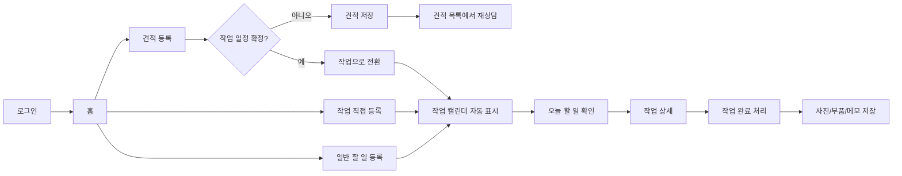

# 경남차유리 업무관리 사용자 Flow

이 문서는 `시스템개발_요구사항정의서_서영산업(주)_260309.docx`를 다시 검토한 뒤, 실제 사용자가 시스템을 쓰는 순서대로 정리한 화면 흐름이다.

## 요구사항 재검토 요약

- 현재는 견적과 작업 스케줄을 구글시트에 수기로 입력하고 있어 번거롭다.
- 목표는 간단한 조작으로 견적과 작업내용을 등록, 관리, 검색하는 것이다.
- 핵심 기능은 로그인, 견적 등록, 작업 등록, 견적에서 작업으로 이동, 작업 캘린더 확인이다.
- 작업 캘린더는 월/주/일 화면 선택이 필요하다.
- 일정 클릭 시 입력했던 작업 상세로 이동해서 견적내용까지 확인할 수 있어야 한다.
- 디자인은 심플하고 깔끔해야 하며, 페이지 로딩과 입력 반응은 매우 빨라야 한다.
- 사용자는 외부 고객이 아니라 내부 직원 중심이며, 예상 동시 사용자는 약 5명이다.

## 사용자 기준

사용자는 IT 시스템을 관리하려는 사람이 아니라, 본인이 매일 처리하는 견적과 작업 데이터를 빠르게 넣고 다시 찾으려는 사람이다.

따라서 화면 기준은 다음과 같다.

- 첫 저장은 최대한 짧게 한다.
- 모르는 정보가 있어도 임시 저장이 가능해야 한다.
- 견적과 작업은 따로 만들 수 있지만, 견적에서 작업으로 바로 넘길 수 있어야 한다.
- 캘린더는 예쁜 달력보다 오늘 할 일을 찾기 쉬워야 한다.
- 유리 교체 작업 외에도 보험 확인, 입금 확인, 부품 발주 같은 일반 할 일도 같이 관리되어야 한다.
- 일정이나 고객을 누르면 관련 정보가 한 화면에서 보여야 한다.
- 등록 버튼은 항상 사용자가 기대하는 위치에 있어야 한다.

## 전체 업무 Flow

## 1. 로그인 Flow

목표: 내부 직원이 빠르게 들어간다.

1. 아이디와 비밀번호를 입력한다.
2. 로그인 버튼을 누른다.
3. 성공하면 홈으로 이동한다.
4. 실패하면 입력칸 아래에 쉬운 문장으로 오류를 보여준다.

UI 기준:

- 회원가입은 없다.
- 아이디 찾기와 비밀번호 찾기는 당장 제공하지 않는다.
- ID 저장과 자동로그인은 로그인 편의 기능으로 제공한다.
- 로고와 상호는 한 번만 보여준다.
- 테스트 계정 문구는 프로토타입 확인용이며, 운영 단계에서는 제거한다.
- 직원/알바 계정 생성과 권한 관리는 V2 고도화에서 최고 관리자 기능으로 설계한다.

## 2. 홈 Flow

목표: 오늘 바로 봐야 하는 업무를 먼저 본다.

홈에서 먼저 보여줄 것:

- 오늘 작업
- 견적 대기
- 청구 대기
- 미수금
- 부족 재고

사용자 행동:

1. 오늘 작업이 있으면 작업 화면으로 이동한다.
2. 견적 대기가 있으면 견적 목록으로 이동한다.
3. 부족 재고나 미수금은 해당 상세로 이동한다.

UI 기준:

- 홈은 설명 화면이 아니라 바로 업무 상태를 보여주는 화면이다.
- 숫자 카드에서 클릭하면 해당 목록으로 이동해야 한다.

## 3. 견적 등록 Flow

목표: 전화나 카카오톡 문의가 왔을 때 빠르게 저장한다.

첫 저장 필수값:

- 고객명 또는 거래처명
- 연락처
- 문의일
- 문의 내용 또는 간단 메모

나중에 채워도 되는 값:

- 차량번호
- 차대번호
- 차 브랜드, 모델명, 년식
- 수리구분
- 수리부위
- 부품번호
- 옵션
- 썬팅
- 보험사, 접수번호

사용자 행동:

1. `견적 등록`을 누른다.
2. 고객/차량/메모를 빠르게 입력한다.
3. 알고 있는 값만 입력한다.
4. 저장한다.
5. 일정이 정해졌다면 `작업으로 등록`을 누른다.

UI 기준:

- 필수 입력이 많아서 저장이 막히면 안 된다.
- 차량, 부품, 거래처는 typeahead 검색으로 고른다.
- 자주 쓰는 값은 최근 입력값을 추천한다.

## 4. 견적에서 작업 전환 Flow

목표: 견적을 다시 입력하지 않고 작업 일정으로 넘긴다.

사용자 행동:

1. 견적 상세에서 `작업으로 등록`을 누른다.
2. 작업일, 작업시간, 매장/출장 여부를 입력한다.
3. 작업자와 메모를 확인한다.
4. 저장하면 작업 캘린더에 자동으로 표시된다.

자동으로 넘어가야 하는 값:

- 고객명
- 연락처
- 차량정보
- 수리구분
- 수리부위
- 견적내용
- 금액
- 부품정보
- 보험 관련 메모

UI 기준:

- `견적 저장`과 `작업으로 등록`은 버튼을 분리한다.
- 작업 전환 화면에서는 일정 입력이 가장 먼저 보여야 한다.
- 사용자는 “이 견적이 작업으로 넘어갔다”는 상태를 바로 확인할 수 있어야 한다.

## 5. 작업 직접 등록 Flow

목표: 견적 없이 바로 잡히는 작업도 빠르게 등록한다.

사용자 행동:

1. 작업 화면에서 `작업 등록`을 누른다.
2. 작업일, 시간, 고객/거래처, 차량, 작업내용을 입력한다.
3. 저장하면 캘린더와 오늘 할 일에 표시된다.

UI 기준:

- 견적에서 넘어온 작업과 직접 등록한 작업은 같은 캘린더에서 보여준다.
- 작업 등록은 일정 입력 중심이어야 한다.
- 상세 입력은 저장 후에도 보완할 수 있어야 한다.

## 6. 작업 캘린더 Flow

목표: 오늘 할 일과 일정 빈칸을 바로 확인한다.

기본 화면:

- 왼쪽: 캘린더
- 오른쪽: 오늘 할 일 목록
- 캘린더 안에는 작업과 일반 할 일을 함께 표시한다.

보기 방식:

- 일: 시간대별 작업 확인
- 주: 요일별 작업 확인
- 월: 날짜별 작업 분포 확인
- 년: 월별 작업량 요약. MVP 필수는 아니며 고도화 또는 요약 화면 성격으로 둔다.

사용자 행동:

1. 작업 화면에 들어오면 오늘 할 일이 먼저 보인다.
2. 일정 카드를 누르면 작업 상세 또는 할 일 메모가 열린다.
3. 오른쪽 오늘 할 일에서 `상세` 또는 `완료`를 바로 누른다.
4. 작업 상태가 바뀌면 캘린더와 목록에 즉시 반영된다.

UI 기준:

- 페이지 상단 제목이 `작업`이면 카드 안에서 `작업 캘린더`를 반복하지 않는다.
- 달력 안 일정은 작게, 오늘 할 일 목록은 더 행동 가능하게 만든다.
- 일정 카드는 고객명, 시간, 작업내용, 상태만 먼저 보여준다.
- 목록 필터는 `전체`, `작업`, `일반`처럼 쉬운 단어로 나눈다.

## 7. 일반 할 일/일정 Flow

목표: 작업이 아닌 매장 업무도 캘린더에서 놓치지 않는다.

예시:

- 보험 접수번호 확인
- 거래처 입금 확인
- 부품 발주 또는 입고 확인
- 고객에게 다시 연락
- 세금계산서나 서류 확인
- 휴무, 외근, 내부 메모

사용자 행동:

1. 작업 화면에서 `할 일 등록`을 누른다.
2. 날짜, 시간, 제목, 담당자, 간단 메모를 입력한다.
3. 저장하면 캘린더와 오늘 할 일에 표시된다.
4. 완료하면 `완료`를 누르고 필요하면 메모를 남긴다.

UI 기준:

- 작업 등록과 할 일 등록은 버튼을 분리한다.
- 일반 할 일은 작업 카드와 색을 다르게 해서 바로 구분한다.
- 일반 할 일에는 고객/차량 정보가 없어도 저장할 수 있어야 한다.
- 반복 일정은 MVP 이후 고도화로 둔다.

## 8. 작업 상세 Flow

목표: 작업자가 필요한 정보를 한 화면에서 확인하고 완료 처리한다.

작업 상세에서 보여줄 것:

- 고객/거래처
- 연락처
- 차량정보
- 작업일/시간
- 매장/출장
- 작업내용
- 연결 견적
- 사용 부품
- 작업 메모
- 사진

사용자 행동:

1. 캘린더 또는 오늘 할 일에서 작업을 누른다.
2. 상세 정보를 확인한다.
3. 작업 완료 시 사진, 부품 사용, 메모를 입력한다.
4. 완료 처리한다.

UI 기준:

- 상세는 별도 페이지보다 모달 또는 오른쪽 패널이 빠르다.
- 완료 처리 버튼은 상세 하단에 고정되어도 좋다.
- 사진과 부품은 나중에 보완 가능해야 한다.

## 9. 검색 Flow

목표: 입력한 데이터를 빠르게 다시 찾는다.

검색 대상:

- 고객명
- 연락처
- 차량번호
- 차대번호
- 거래처명
- 부품번호
- 견적번호
- 작업번호

사용자 행동:

1. 상단 검색창에 일부 글자만 입력한다.
2. 자동완성 결과를 선택한다.
3. 선택한 고객/차량/작업 상세로 이동한다.

UI 기준:

- 검색은 전체 범위 검색이어야 한다.
- 결과는 고객, 차량, 견적, 작업 구분이 보이게 한다.
- 검색 결과를 누르면 사용자가 찾으려던 상세로 바로 간다.

## 10. 예외 Flow

실무에서는 정보가 한 번에 다 들어오지 않는다. 그래서 저장을 막기보다 상태로 관리한다.

- 차량번호 모름: 임시 저장
- 보험 접수번호 대기: 확인 필요 상태
- 부품번호 모름: 부품 확인 상태
- 작업시간 미정: 날짜만 저장
- 견적만 저장하고 작업은 나중에 전환
- 작업이 취소되면 취소 사유를 메모로 남김

## MVP 화면 우선순위

1. 로그인
2. 홈
3. 견적 목록
4. 견적 등록/상세
5. 견적에서 작업 전환
6. 작업 캘린더
7. 일반 할 일 등록/처리
8. 오늘 할 일
9. 작업 상세
10. 고객/차량 상세
11. 검색

## 현재 프로토타입에 반영할 UX 방향

- 작업 화면은 캘린더와 오늘 할 일을 함께 둔다.
- 작업 외 일반 일정도 같은 캘린더에서 관리한다.
- 화면 제목과 카드 제목은 중복하지 않는다.
- 입력 폼은 한 번에 길게 펼치기보다 빠른 저장 후 보완하는 방식으로 만든다.
- 등록 버튼은 주요 화면마다 명확하게 배치한다.
- 사용자가 직접 계산해야 하는 값은 줄이고 자동 계산 결과를 보여준다.
- 리스트, 캘린더, 상세가 서로 끊기지 않게 이동한다.
